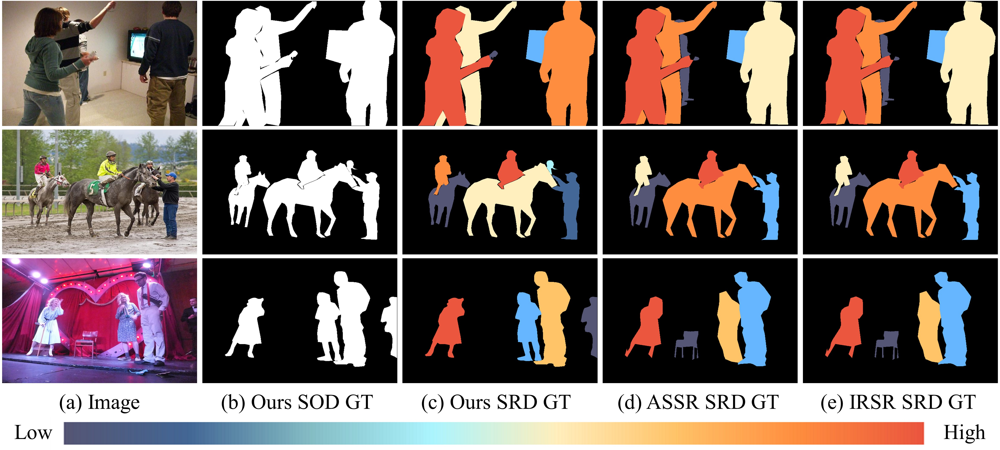
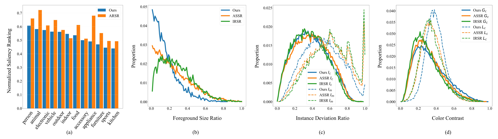
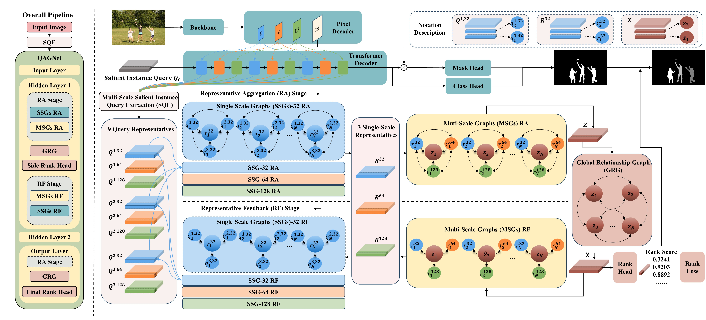
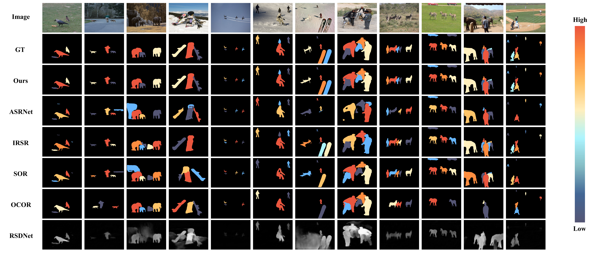

# SIFR Dataset and QAGNet
This is the official repository for the CVPR 2024 paper **Advancing Saliency Ranking with Human Fixations:
Dataset, Models and Benchmarks.**

## SIFR Dataset - From Mouse-Trajectories to Real Human Gaze

We present the first saliency ranking dataset, SIFR, using genuine human fixations rather than mouse movements (ASSR and IRSR).

### Differences between Human Gaze GT and Mouse-Trajectory GT:

### Dataset Analysis:

### Download [SIFR](https://drive.google.com/file/d/1Gop2GtVQI5ZND-npBo_yp2brU_hPmdKZ/view?usp=sharing) dataset (Google Drive).

## QAGNet - Query as Graph Network

To establish a baseline for this dataset, we propose QAGNet, a novel model that leverages salient instance query features from a query-based transformer detector (Mask2Former) within a tri-tiered nested graph.

### Installation

Our proposed QAGNet is based on [Mask2Former](https://github.com/facebookresearch/Mask2Former). Please follow the [instructions](https://github.com/facebookresearch/Mask2Former/blob/main/INSTALL.md) to install the environment (Pytorch, Detectron2, MSDeformAttn etc). The main codes of QAGNet are written in ./mask2former/modeling/transformer_decoder/mask2former_transformer_decoder.py.

### Training Model
- Download [ASSR](https://github.com/SirisAvishek/Attention_Shift_Ranks), [IRSR](https://github.com/dragonlee258079/Saliency-Ranking/tree/9fd1cd5b919f629ea044a4112baa0919b6f663ac) and [SIFR](https://drive.google.com/file/d/1Gop2GtVQI5ZND-npBo_yp2brU_hPmdKZ/view?usp=sharing) dataset (Google Drive).
- Configure the dataset path in train_net.py/def main(args).
- Download the [pretrained weights of Mask2Former](https://drive.google.com/file/d/1M0SxSxwM1PqxGsp7hVCgLQzczX-YB7hk/view?usp=sharing)
- Configure the corresponding yaml scripts (./configs/coco/instance-segmentation/) - Base-COCO-InstanceSegmentation/R50_bs16_50ep/swin_base_IN21k_384_bs16_50ep/swin_large_IN21k_384_bs16_100ep
- Configure and run train_net.py.

### Testing QAGNet
- Download our [pretrained models](https://drive.google.com/file/d/1OlMN-0QKyOK9BMzjCRNnqhcG89r0uDWY/view?usp=sharing) for Res50, Swin-B and Swin-L.
- Configure the pretrained weights path in corresponding yaml files.
- Configure the evaluation settings in Base-COCO-InstanceSegmentation.yaml.
- Configure and run plain-test.py.

## Benchmark

We opensource all SRD models' [predicted saliency ranking maps](https://drive.google.com/file/d/1A4NQoUQYmSV6sm1wsVt0fcknguIqW2QV/view?usp=sharing) (Google Drive). For more quantitative comparison and qualitative comparisons, please refer to our our paper and supplementary material.

## Citing SIFR Dataset and QAGNet

If you find the SIFR dataset or QAGNet beneficial for your work, please consider citing our research:

To do.

